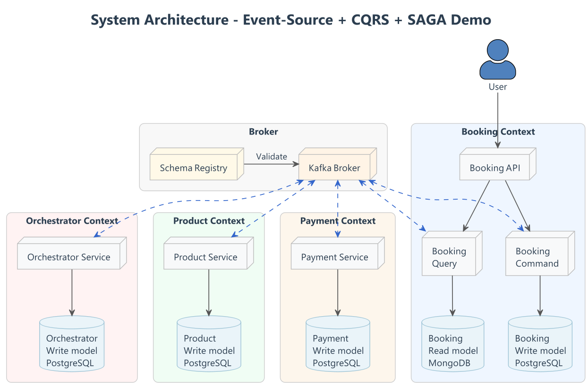
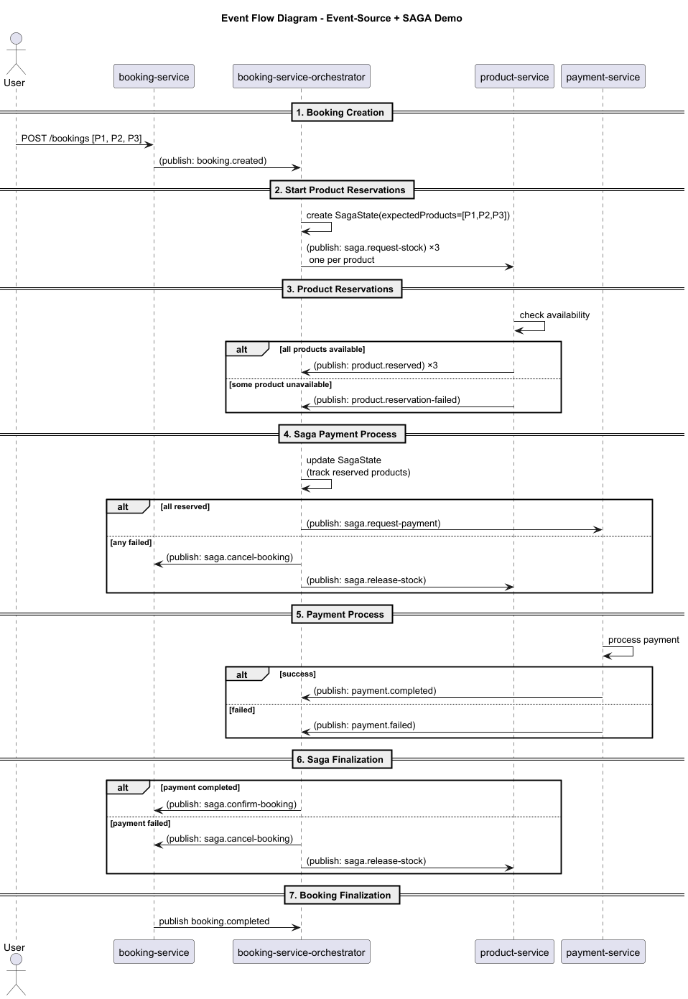

# Event-Sourcing · CQRS · SAGA · Observability Platform


This project is a technical demonstration of an event-sourcing microservices architecture, designed to showcase advanced
backend engineering concepts such as CQRS, SAGA orchestration, idempotency, event versioning, distributed tracing, and
resilience patterns.

The objective is to illustrate how to design, implement, and operate a production-grade distributed system based on
asynchronous communication using Apache Kafka, ensuring eventual consistency, traceability, and observability across
services.

---

## 🧠 Key Concepts Demonstrated

| Category          | Concept                | Description                                                                                                                                                                                         |
|-------------------|------------------------|-----------------------------------------------------------------------------------------------------------------------------------------------------------------------------------------------------|
| **Architecture**  | Hexagonal              | Services follow the hexagonal design, decoupling core domain logic from infrastructure like Kafka, REST APIs, and databases for modularity, testability, and maintainability.                       |
| **Data Pattern**  | Event Sourcing         | Application state is captured as a sequence of domain events **published to Kafka**. Events are persisted in PostgreSQL for durability and can be replayed or reconstructed for full auditability.  |
| **Data Pattern**  | CQRS (Command / Query) | Separates commands (writes) from queries (reads). Commands update PostgreSQL events; queries are served from MongoDB projections, enabling independent scaling and optimized read/write operations. |
| **Workflow**      | SAGA Orchestration     | Coordinates distributed transactions across services with compensating actions to ensure eventual consistency.                                                                                      |
| **Messaging**     | Kafka-centric Design   | Kafka is the backbone for all domain communication and integration events.                                                                                                                          |
| **Contracts**     | Avro + Schema Registry | Central repository of Avro schemas for validation, versioning, and backward/forward compatibility of events.                                                                                        |
| **Resilience**    | Inbox Pattern          | Ensures idempotent processing of incoming messages, preventing side effects from duplicated events.                                                                                                 |
| **Resilience**    | Transactional Outbox   | Guarantees "at-least-once" delivery by persisting events in the DB before publishing them to Kafka, avoiding data loss.                                                                             |
| **Resilience**    | Dead Letter Queue      | Automated handling of unprocessable messages to prevent pipeline clogging and facilitate debugging.                                                                                                 |
| **Observability** | Monitoring             | Prometheus collects time-series metrics while Grafana provides centralized dashboards for system health and KPIs.                                                                                   |
| **Observability** | Logging                | Promtail ships logs from containers to Loki, enabling log aggregation and correlation with metrics and traces.                                                                                      |
| **Observability** | Distributed Tracing    | End-to-end visibility using Jaeger and OpenTelemetry to visualize and debug SAGA transactions across multiple microservices.                                                                        |
| **Testing**       | Testcontainers         | End-to-end testing with ephemeral Kafka, PostgreSQL, and MongoDB instances to ensure reliable integration and system behavior.                                                                      |

> These concepts are implemented, not described theoretically.
---

## 🧩 Project Structure

| Directory                                                                                                          | Description                                                                                                         |
|--------------------------------------------------------------------------------------------------------------------|---------------------------------------------------------------------------------------------------------------------|
| [`mengo-platform/`🔗 ](mengo-platform/README.md)                                                                   | Core platform layer. Custom Spring Boot starters, shared infrastructure, observability interceptors, Kafka tooling. |
| [`schemas-registry` 🔗 ](schemas-registry/README.md)                                                               | Centralized Avro schemas for all domain events, used for validation and compatibility.                              |
| [`booking-service-api/`🔗 ](booking-service-api/README.md)                                                         | OpenAPI definitions and Feign clients. API contracts decoupled from implementations.                                |
| [`booking-service-orchestrator/` 🔗 ](booking-service-orchestrator/README.md)                                      | SAGA orchestrator coordinating booking, product, and payment workflows.                                             |
| [`booking-service/`🔗 ](booking-service/README.md)                                                                 | Booking write model. Receives commands and emits domain events.                                                     |
| [`payment-service/`🔗 ](payment-service/README.md)                                                                 | Handles payment workflows and compensations.                                                                        |
| [`product-service/`🔗 ](product-service/README.md)                                                                 | Handles product reservation and stock consistency.                                                                  |
| [`e2e-tests/`🔗 ](e2e-tests/README.md)                                                                             | Full end-to-end tests with Docker + Testcontainers.                                                                 |
| [`observability/`🔗 ](observability/README.md)                                                                     | Metrics, logs, traces correlated by design.                                                                         |
| [`docs/`🔗 ](https://github.com/matiesmengo/event-sourcing-cqrs-demo/tree/main/docs/architecture-decision-records) | Architecture diagrams, ADRs, and technical documentation.                                                           |

---

## 🧱 Architecture Overview

### 📑 Core Patterns

- Hexagonal Architecture (strict layer enforcement)
- Event Sourcing per aggregate
- CQRS (write model + read model separation)
- SAGA orchestration with compensation
- Contract-first APIs & events

[Architecture Decision Records 🔗 ](https://github.com/matiesmengo/event-sourcing-cqrs-demo/tree/main/docs/architecture-decision-records)

### 🛡️ Messaging & Data Integrity

- Kafka as event backbone
- Transactional Outbox (at-least-once delivery)
- Inbox pattern (SQL-level idempotency)
- Event versioning & replay safety
- Private database per service (no sharing)
- Dead Letter Topics

### 📊 Observability

- Distributed tracing (Jaeger + OpenTelemetry)
- Metrics (Prometheus + Micrometer)
- Structured logging (Loki + Promtail)
- Correlation across logs, metrics i traces
- Pre-built Grafana dashboards

[Observability documentation 🔗 ](./observability/README.md)

### 🧰 Platform Engineering (Hidden Work, Explicitly Done)

The mengo-platform module encapsulates:

- Observability interceptors
- Kafka test utilities
- Shared retry and error handling
- Architecture enforcement
- Dependency alignment

This avoids infrastructure duplication and keeps domains clean.

[Platform documentation 🔗 ](./mengo-platform/README.md)


## High-Level Architecture



---

## 🔄 Event Flow




---

## 📕 Tech Stack

| Layer / Purpose                | Technology & Version                        | Description / Role                                                                                                |
|--------------------------------|---------------------------------------------|-------------------------------------------------------------------------------------------------------------------|
| **Language & Framework**       | Java 21 / Kotlin 2.0.21 / Spring Boot 3.4.0 | Core language and framework for microservices, dependency injection, REST, and application bootstrapping.         |
| **Messaging / Event Bus**      | Apache Kafka                                | Asynchronous backbone for event-driven communication between microservices.                                       |
| **Schema Management**          | Confluent Schema Registry                   | Centralized Avro schemas for validation, evolution, and backward/forward compatibility.                           |
| **Persistence**                | PostgreSQL                                  | Relational database for persisting events, snapshots, and transactional state in each service.                    |
| **Read Model / Projection DB** | MongoDB                                     | Stores read-model projections for efficient queries in CQRS, enabling fast and flexible read operations.          |
| **Testing / CI**               | Testcontainers                              | Ephemeral Kafka, PostgreSQL, and MongoDB environments for unit, integration, and end-to-end testing.              |
| **Containerization / DevOps**  | Docker Compose                              | Local orchestration of microservices, databases, and Kafka for reproducible development and testing environments. |
| **Observability**              | OpenTelemetry / Micrometer                  | Distributed tracing and metrics collection for monitoring, performance, and troubleshooting.                      |

---

## 🚀 Getting Started

### Requirements

* **Java 21+**
* **Docker**
* **Maven 3.9+**

### Run Locally

```bash
# 1. Local docker 
docker-compose up -d

# 2. Build all modules
mvn clean package

# 3. Launch run time services
cd booking-service | mvn spring-boot:run
cd payment-service | mvn spring-boot:run
cd product-service | mvn spring-boot:run
cd booking-service-orchestration | mvn spring-boot:run
```

### Access points

* **Booking API:** [http://localhost:8080/api/bookings](http://localhost:8080/api/bookings)

```bash
curl --location 'localhost:8080/bookings' \
--header 'x-forced-payment-outcome: SUCCESS' \
--header 'Content-Type: application/json' \
--data '{
    "userId": "99999999-0000-0000-0000-999999999999",
    "products": [
        {
            "productId": "11111111-1111-1111-1111-111111111111",
            "quantity": 1
        },
        {
            "productId": "22222222-2222-2222-2222-222222222222",
            "quantity": 2
        }
    ]
}'
```

---

## 🧪 Testing Strategy (Serious Testing)

Testing mirrors production as closely as possible.

- *Unit Tests*: Validate pure domain logic.
- *Integration Tests*: Kafka + PostgreSQL via Testcontainers.
- *End-to-End Tests*: Full system execution using Docker images and real infrastructure.

End-to-end tests spin up:

- Kafka + Schema Registry
- Multiple PostgreSQL instances
- All microservices as Docker containers

> No mocks. No shortcuts.

[E2E Documentation 🔗 ](./e2e-tests/readme.md)

---

## 🧭 To do

| Area            | Next Step                                                                      |
|-----------------|--------------------------------------------------------------------------------|
| **Persistence** | Implement Queries and update projections (CQRS)                                |
| **CI/CD**       | Automate tests and build with GitHub Actions                                   |
| **Performance** | Implement load and performance tests to evaluate system throughput and latency |

---

## 👤 Author

**Maties Mengo**

*Senior Backend Engineer*

🌐 [GitHub — matiesmengo](https://github.com/matiesmengo)

🔗 [LinkedIn — matiesmengo](https://www.linkedin.com/in/matiesmengo)

If you find this project useful or interesting, feel free to ⭐ the repository or use it as reference.