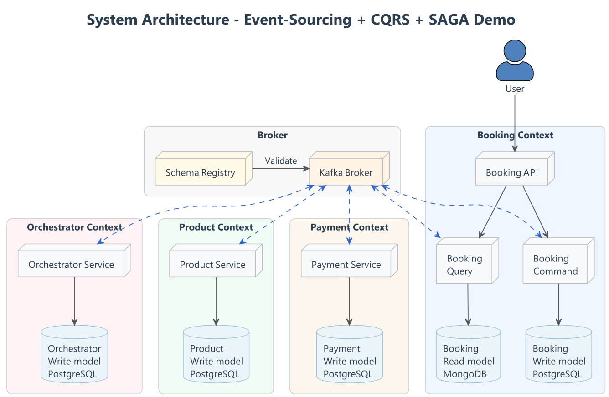
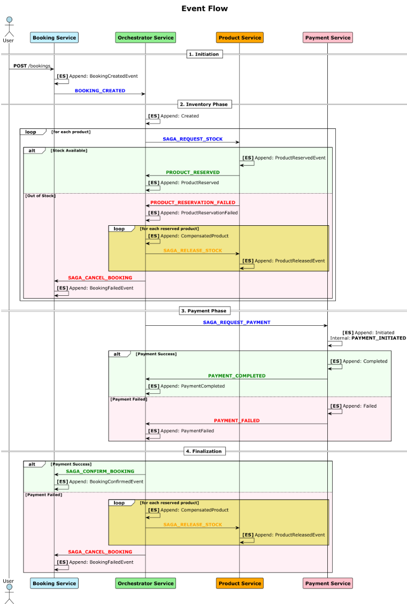
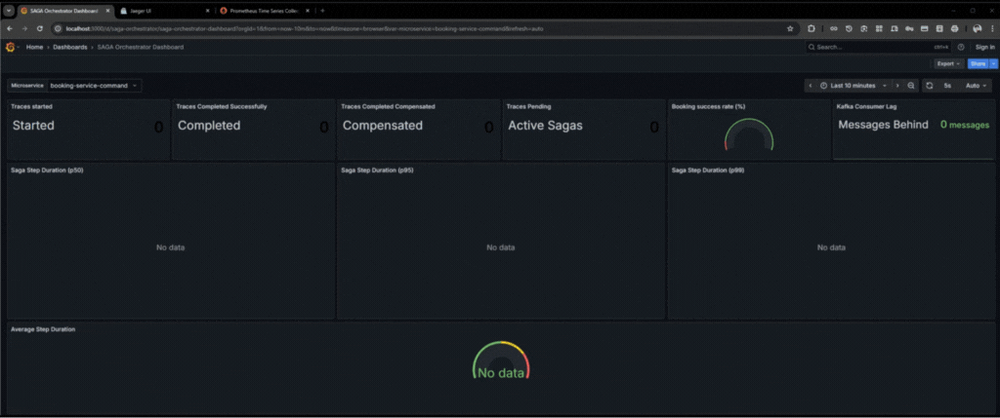

# High-Resilience Distributed Systems: Event Sourcing, CQRS & SAGA


## 🎯 The Objective: Reliability at Scale
Distributed consistency is the "Achilles' heel" of microservices. This project moves beyond basic CRUD to showcase a **production-grade Booking Engine** where data integrity and system availability are non-negotiable.

The architecture is engineered to guarantee:

- **Total Auditability:** A 100% immutable history of every business decision using Event Sourcing.
- **Zero Data Loss:** Atomic state changes and reliable messaging via Transactional Outbox.
- **Fault Tolerance:** Self-healing distributed transactions with SAGA Orchestration and automated rollbacks.
- **Elastic Performance:** Independent scaling of Read and Write models through CQRS.

**The Result:** A system designed for high-concurrency that maintains 100% integrity, even when critical services like Payments or Inventory face latency or downtime.

---

## 🏗️ High-Level Architecture

The system follows a **Polyglot Persistence strategy** and an asynchronous communication model. 
**Apache Kafka** serves as the central nervous system, decoupling domains while ensuring reliable event propagation.



---

## 🔄 Event Flow

Managing transactions across multiple services (Booking, Payment, Product) requires a robust coordination strategy. This project implements an **Orchestrated SAGA** to handle both the "Happy Path" and automated **Compensating Transactions** (rollbacks) in case of failure.



---

## 🔍 Observability & Traceability

In a distributed environment, "blindness" is the biggest operational risk. This project implements a full observability stack to ensure that every asynchronous message and service call is accounted for.

* **Distributed Tracing:** End-to-end visibility using **OpenTelemetry** and **Jaeger**.
* **Metrics & Dashboards:** Real-time system health via **Prometheus** and **Grafana**.
* **Log Aggregation:** Centralized and correlated logs using **Loki** and **Promtail**.




> For a deep dive into how these tools are integrated, check the [Observability documentation 🔗](./observability/README.md).

---

## 🧩 Project Structure & Modules

The repository is organized into specialized modules to enforce a clean separation of concerns and facilitate independent scaling.

| Directory                                                                                                          | Description                                                                                                         |
|--------------------------------------------------------------------------------------------------------------------|---------------------------------------------------------------------------------------------------------------------|
| [`mengo-platform/`🔗 ](mengo-platform/README.md)                                                                   | Core platform layer. Custom Spring Boot starters, shared infrastructure, observability interceptors, Kafka tooling. |
| [`schemas-registry` 🔗 ](schemas-registry/README.md)                                                               | Centralized Avro schemas for all domain events, used for validation and compatibility.                              |
| [`booking-service-api/`🔗 ](booking-service-api/README.md)                                                         | OpenAPI definitions and Feign clients. API contracts decoupled from implementations.                                |
| [`booking-service-orchestrator/` 🔗 ](booking-service-orchestrator/README.md)                                      | SAGA orchestrator coordinating booking, product, and payment workflows.                                             |
| [`booking-service-command/`🔗 ](booking-service-command/README.md)                                                 | Booking write model. Receives commands and emits domain events.                                                     |
| [`booking-service-query/`🔗 ](booking-service-query/README.md)                                                     | Booking read model. Receives commands and create a booking projection.                                              |
| [`payment-service/`🔗 ](payment-service/README.md)                                                                 | Handles payment workflows and compensations.                                                                        |
| [`product-service/`🔗 ](product-service/README.md)                                                                 | Handles product reservation and stock consistency.                                                                  |
| [`test-suite/`🔗 ](test-suite/README.md)                                                                             | Full end-to-end tests with Docker + Testcontainers.                                                                 |
| [`observability/`🔗 ](observability/README.md)                                                                     | Metrics, logs, traces correlated by design.                                                                         |
| [`docs/`🔗 ](https://github.com/matiesmengo/event-sourcing-cqrs-demo/tree/main/docs/architecture-decision-records) | Architecture diagrams, ADRs, and technical documentation.                                                           |

---

## 🧠 Technical Deep Dive

### 📑 Core Patterns & Reliability
Instead of theory, this project focuses on **real-world implementation** of distributed patterns:

| Category          | Concept                  | Implementation Highlights                                   |
|:------------------|:-------------------------|:------------------------------------------------------------|
| **Data**          | **Event Sourcing**       | Immutable event store in PostgreSQL with Kafka propagation. |
| **Data**          | **CQRS**                 | Write model (Postgres) / Read model (MongoDB) separation.   |
| **Resilience**    | **Transactional Outbox** | Atomic DB updates & event publishing.                       |
| **Resilience**    | **Inbox Pattern**        | Guaranteed idempotency at the database level.               |
| **Contracts**     | **Avro**                 | Schema Registry enforcement for all integration events.     |
| **Observability** | **Full Stack**           | Traces (Jaeger), Metrics (Grafana), Logs (Loki).            |


> 💡 *Check the [Architecture Decision Records (ADRs) 🔗](https://github.com/matiesmengo/event-sourcing-cqrs-demo/tree/main/docs/architecture-decision-records) for a deep dive into "The Why" behind these choices.*

### 🧰 Platform Engineering (The "Shared Core")
The `mengo-platform` module encapsulates infrastructure concerns to keep business domains clean:
- 🚀 **Standardized Kafka Tooling:** Common producer/consumer configurations.
- 🛡️ **Resilience Starters:** Global error handling and retry policies.
- 📊 **Auto-Tracing:** Pre-configured OpenTelemetry interceptors.
- 🧪 **Test Utilities:** Shared Testcontainers abstractions.

> For a deep dive into maven management, check the [Platform documentation 🔗 ](./mengo-platform/README.md)

---

## 🧪 Testing Strategy: No Mocks, No Shortcuts
Testing mirrors production environments using **Testcontainers**.

- **Unit Tests:** Pure domain logic validation.
- **Integration Tests:** Verifying Kafka & DB interactions in real environments.
- **End-to-End Tests:** Full SAGA flow execution using Dockerized services.

> Check the documentation [Test suite documentation 🔗 ](test-suite/README.md)

---

## 📕 Tech Stack Summary

| Layer | Technology | Role |
|:------|:-----------|:-----|
| **Framework** | **Kotlin / Java 21 / Spring Boot 3.4** | Core language and application framework. |
| **Messaging** | **Apache Kafka & Schema Registry** | Backbone for event-driven communication and contract safety. |
| **Databases** | **PostgreSQL & MongoDB** | Event store (Relational) and Projections (Document-based). |
| **Observability** | **OTel, Prometheus, Grafana, Jaeger** | The "Golden Signals" of monitoring (Traces, Metrics, Logs). |
| **DevOps/Testing** | **Docker & Testcontainers** | Local orchestration and ephemeral testing environments. |

---

## 🚀 Getting Started
### Run Locally

```bash
# 1. Local docker 
docker-compose up -d

# 2. Build all modules
mvn clean package -DskipTests

# 3. Launch run time services
mvn spring-boot:run -pl booking-service-command
mvn spring-boot:run -pl booking-service-query
mvn spring-boot:run -pl payment-service
mvn spring-boot:run -pl product-service
mvn spring-boot:run -pl booking-service-orchestration
```

### Access points

* **Booking API:** [http://localhost:8080/api/bookings](http://localhost:8080/api/bookings)

```bash
curl --location 'localhost:8080/bookings' \
--header 'x-forced-payment-outcome: SUCCESS' \
--header 'Content-Type: application/json' \
--data '{
    "userId": "99999999-0000-0000-0000-999999999999",
    "products": [
        {
            "productId": "aaaa0000-aaaa-0000-aaaa-000000000001",
            "quantity": 1
        },
        {
            "productId": "bbbb0000-bbbb-0000-bbbb-000000000002",
            "quantity": 2
        }
    ]
}'
```

---

## 🧭 Future Roadmap & Evolution

| Area | Next Step | Impact |
|:---|:---|:---|
| **Scalability** | Snapshotting | Optimize Event Sourcing recovery time for long-lived aggregates. |
| **CI/CD** | GitHub Actions Pipeline | Automate the full build-test-deploy lifecycle with quality gates. |
| **Performance** | K6 Load Testing | Stress test the SAGA coordinator to identify orchestration bottlenecks. |

---

## 👤 Author

**Maties Mengo**

*Senior Backend Engineer*

🌐 [GitHub — matiesmengo](https://github.com/matiesmengo)

🔗 [LinkedIn — matiesmengo](https://www.linkedin.com/in/matiesmengo)

If you find this project useful or interesting, feel free to ⭐ the repository or use it as reference.