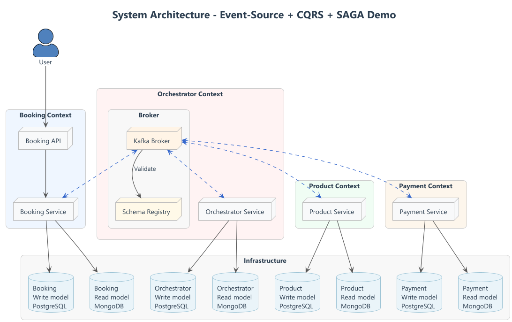

# Event-Driven Demo


This project is a technical demonstration of an event-driven microservices architecture, designed to showcase advanced backend engineering concepts such as CQRS, partial Event Sourcing, idempotency, event versioning, distributed tracing, and resilience patterns.

The objective is to illustrate how to design, implement, and operate a production-grade distributed system based on asynchronous communication using Apache Kafka, ensuring eventual consistency, traceability, and observability across services.

---

## 🧠 Key Concepts Demonstrated

| Category          | Concept                    | Description                                                                           |
| ----------------- |----------------------------| ------------------------------------------------------------------------------------- |
| **Architecture**  | Event-Driven + Hexagonal   | Services communicate asynchronously through Kafka events.                             |
| **Consistency**   | Eventual consistency       | Each service maintains local state derived from domain events.                        |
| **Reliability**   | Idempotent consumers       | Ensures events are processed exactly once logically, even if received multiple times. |
| **Contracts**     | Schema Registry            | Central contract repository using Avro schemas for validation and evolution.          |
| **Testing**       | Testcontainers             | End-to-end testing with ephemeral Kafka, PostgreSQL, and services.                    |
| **Resilience**    | Retry, DLQ, Outbox Pattern | Ensures message delivery under transient failures.                                    |
| **Observability** | Tracing & Metrics          | OpenTelemetry and Micrometer integration for cross-service tracing.                   |

---

## 🧩 Project Structure

| Directory                        | Description                                                                            |
| -------------------------------- | -------------------------------------------------------------------------------------- |
| `mengo-platform/mengo-bom`       | BOM to manage dependency versions across modules.                                      |
| `mengo-platform/mengo-parent`    | Parent POM defining unified build and dependency management.                           |
| `mengo-platform/mengo-starters/` | Custom Spring Boot starters for Kafka, PostgreSQL, metrics, and testing.               |
| `schemas-registry/`              | Centralized Avro schemas for all domain events, used for validation and compatibility. |
| `booking-service-api/`           | OpenAPI definition and Feign clients for synchronous communication.                    |
| `booking-service/`               | Handles booking creation; publishes and consumes domain events.                        |
| `payment-service/`               | Handles payment workflows; consumes booking events and emits payment outcomes.         |
| `e2e-tests/`                     | End-to-end tests using Testcontainers and Docker Compose.                              |
| `docs/`                          | Architecture documentation, ADRs, and UML diagrams.                                    |

---

## 🧱 Architecture Overview

### Core Design Principles

- *Loose Coupling:* Each service owns its own database and publishes/consumes domain events.
- *Asynchronous Communication:* Kafka is the main message backbone.
- *Contract-first Schema Evolution:* Every event schema is versioned and validated at runtime.
- *Observability-first:* Tracing, logging, and metrics are part of the architecture from day one.
- *Resilience by Design:* Outbox pattern, retries, idempotent handlers, and DLQs ensure robustness.

### High-Level Architecture


---

## 🔄 Event Flow

1. **Booking Creation**
   - Client calls `/api/bookings` via REST
   - `BookingService` validates request, 
   - Save booking status created to postgresql
   - Publishes `BookingCreated` event to Kafka

2. **Payment Processing**
   - `PaymentService` consumes `BookingCreated`
   - Save state pending to postgresql
   - Initiates payment workflow
   - Update state completed/failed to postgresql
   - Publishes `PaymentCompleted` or `PaymentFailed`

3. **Booking Confirmation**
   - `BookingService` consumes payment events
   - Updates booking status paid to postgresql
   - Publishes `BookingConfirmed` or `BookingCancelled`

---

## 🧰 Tech Stack

| Layer / Purpose               | Technology & Version                   | Description / Role                                                                                        |
| ----------------------------- |----------------------------------------| --------------------------------------------------------------------------------------------------------- |
| **Language & Framework**      | Java 21 / Kotlin 1.9.25 / Spring Boot 3.5.x | Core language and framework for microservices, dependency injection, REST, and application bootstrapping. |
| **Messaging / Event Bus**     | Apache Kafka                           | Asynchronous backbone for event-driven communication between microservices.                               |
| **Schema Management**         | Confluent Schema Registry              | Centralized Avro schemas for validation, evolution, and backward/forward compatibility.                   |
| **Persistence**               | PostgreSQL                             | Relational database for each service to maintain local state.                                             |
| **Testing / CI**              | Testcontainers                         | Ephemeral Kafka, PostgreSQL, and service environments for reliable integration & E2E testing.             |
| **Containerization / DevOps** | Docker Compose                         | Local orchestration of microservices, databases, and Kafka for reproducible environments.                 |
| **Observability / Metrics**   | OpenTelemetry / Micrometer             | Distributed tracing and metrics collection for monitoring, performance, and troubleshooting.              |

---

## 🚀 Getting Started

### Requirements

* **Java 21+**
* **Docker**
* **Maven 3.9+**

### Run Locally

```bash
# 1. Local docker 
docker-compose up -d

# 2. Build all modules
mvn clean package

# 3. Launch run time services
cd booking-service && mvn spring-boot:run
cd payment-service && mvn spring-boot:run
```

### Access points

* **Booking API:** [http://localhost:8080/api/bookings](http://localhost:8080/api/bookings)

* **Booking Service:** executable demo
```bash
curl --location 'localhost:8080/bookings' \
--header 'Content-Type: application/json' \
--data '{
"userId": "1881b6c3-1786-4b89-b213-84ab680e03ff",
"resourceId": "6ae4b636-de29-4982-abd0-e588b4078a9f"
}'
```

---

## 🧪 Testing and Quality

* **Unit tests:** validate internal business logic.


* **Integration tests:** validate Kafka and Postgres conections using Testcontainers.


```bash
# Run unit and integration tests
docker-compose up -d
mvn clean verify
```

* **End to End tests:** validate feign request, kafka topics and postgres persistence using Testcontainers.

```bash
# Run e2e tests
# 1. Start infrastructure
docker-compose up -d

# 2. Build all modules
mvn clean package

# 3. Build images
docker build -t booking-service:latest -f booking-service/Dockerfile .
docker build -t payment-service:latest -f payment-service/Dockerfile .

# 4. Execute tests
mvn -pl e2e-tests test
```
---

## 🧭 To do
| Area              | Next Step                                                 |
| ----------------- | --------------------------------------------------------- |
| **Persistence**   | Implement CQRS (Command/Query Responsibility Segregation) |
| **Resilience**    | Implement retries, DLQ, and idempotent message handling   |
| **Observability** | Integrate Micrometer + Prometheus + OpenTelemetry tracing |
| **CI/CD**         | Automate tests and build with GitHub Actions              |

---

## 👤 Author

**Maties Mengo**

*Senior Backend Engineer*

🌐 [GitHub — matiesmengo](https://github.com/matiesmengo)

🔗 [LinkedIn — matiesmengo](https://www.linkedin.com/in/matiesmengo)
