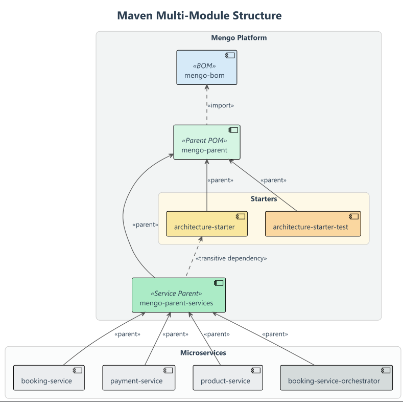

# 🚀 Mengo Platform Foundation

**The Backbone of the Ecosystem** `mengo-platform` is a specialized internal platform designed to enforce architectural governance and accelerate the development of high-resilience microservices. It centralizes dependency management, build lifecycles, and cross-cutting concerns (Resilience, Observability, Testing).

---

## 🏗️ Maven Hierarchy & Architecture

The platform uses a **multi-tiered inheritance model** to decouple dependency versions from build configuration.  
Services inherit standard settings, libraries, and architectural patterns without duplication.

---

## 🏛️ Platform Architecture & Governance

The platform is engineered as a set of modular components that enforce technical standards while minimizing boilerplate for domain developers.

| Artifact                      | Type       | Strategic Value                                                                                                     |
|:------------------------------|:-----------|:--------------------------------------------------------------------------------------------------------------------|
| **mengo-bom**                 | BOM        | **Version Harmony:** Centralizes all library versions (Spring Boot, Kotlin, Avro), eliminating "Dependency Hell".   |
| **mengo-parent**              | Parent POM | **Build Standardization:** Configures Kotlin compiler plugins (`all-open`, `jpa`) and global repository management. |
| **mengo-parent-services**     | Parent POM | **Service Blueprint:** Injects the core architecture, Docker layering, and Spring Boot repackaging defaults.        |
| **architecture-starter**      | Library    | **The Engine:** Implements the foundational resilience patterns (Outbox/Inbox) and telemetry interceptors.          |
| **architecture-starter-test** | Library    | **The Safety Net:** Provides a zero-config testing infrastructure with Testcontainers and ArchUnit rules.           |

---

## 🧩 Shared Starters: "Invisible" Resilience

We move beyond simple libraries by providing **pre-configured behavior**. By simply adding these starters, a microservice inherits production-grade capabilities without manual setup.

### 🛡️ `architecture-starter` (The Resilience Engine)
This core module ensures the system's integrity across asynchronous boundaries:
* **Transactional Outbox & Inbox:** Out-of-the-box logic to guarantee "at-least-once" delivery and prevent side effects from duplicated messages (idempotency).
* **AOP Telemetry:** Aspect-oriented interceptors that automatically propagate `traceId`, `correlationId`, and `causationId` through Kafka headers and logs.
* **Standardized Kafka Tooling:** Optimized defaults for producers and consumers (retries, backoff policies, and serialization).

### 🧪 `architecture-starter-test` (The Safety Net)
This module ensures that the "Senior" standards are actually maintained through automated verification:
* **Container Factories:** Ready-to-use **Testcontainers** abstractions for Kafka, PostgreSQL, and MongoDB, ensuring tests run against real infrastructure.
* **Hexagonal Enforcement:** Integrated **ArchUnit** rules that fail the build if domain boundaries are crossed or if dependencies leak into the core.
* **Distributed Audit Helpers:** Specialized utilities to verify the state of the Event Store and the correct emission of Kafka events during integration tests.
---

## ⚙️ Implementation Highlights

### 🐳 Optimized Docker Layering
We use Spring Boot 3's layering to separate the **Library JARs** from the **Application code**.
* **Impact:** Re-building a service only pushes a few KBs (app layer) instead of MBs (dependencies), drastically reducing CI/CD costs and deployment times.

### 📜 Centralized Governance
The platform ensures that every microservice follows the same **Architecture Decision Records (ADRs)**. Any change in the `mengo-platform` propagates through the ecosystem, ensuring high maintainability.

> 💡 *For a deep dive into our design choices, check the [Architecture Decision Records (ADRs) 🔗](https://github.com/matiesmengo/event-sourcing-cqrs-demo/tree/main/docs/architecture-decision-records).*